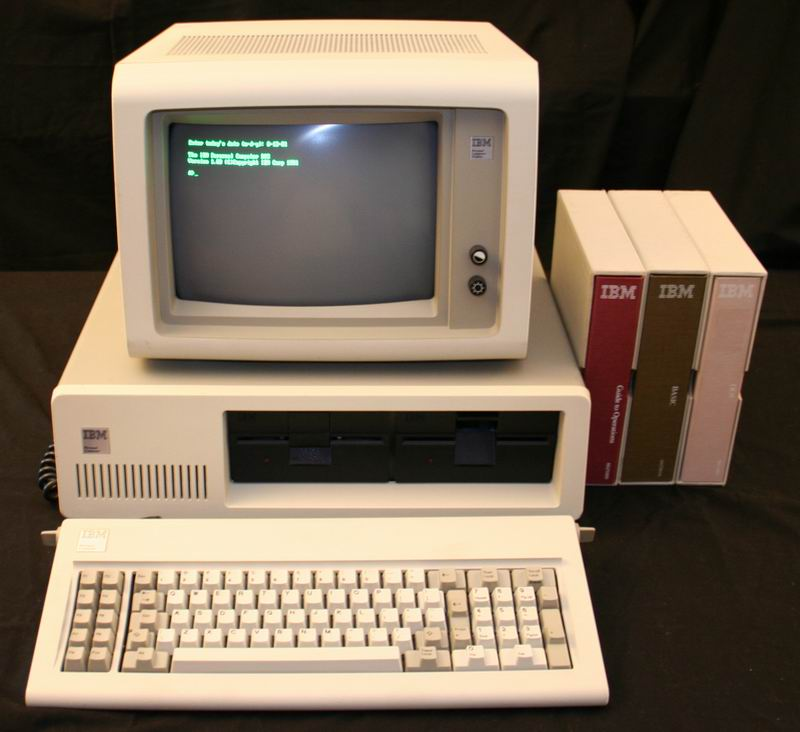

# presentation
Interview presentation

---

# Introduction

- Born and raised in the Silicon Valley of India (Bengaluru, India) 🇮🇳

- Bachelor’s degree in Information Science and Engineering from BMS College of Engineering

- Master’s degree in Computer Science from University of Colorado Boulder (SkoBuffs!) 🏔️

- I have over 3+ years of experience as a Full Stack Engineer
	- Worked at both budding startups and large organizations

- I love building things and I’m most attracted to solving real world problem with large scale impact!

- Currently working as Full Stack Developer for Microgrid Labs

---
<!-- fg=white bg=black -->
# Computers

---
<!-- fg=white bg=black -->

## Journey 🛣️
- Started with DOS Games (1998)
	- Dave 🤩
	- Mario

- Internship at IISc (2014)
	- Text To Speech system in native Indian Languages (Kannada and Tamil)

- Navigation System for Blind (2015)

---
<!-- fg=white bg=black -->

# Interests and Hobbies

- Calligraphy ✍️
- Cooking 👨‍🍳
- Used to play Competative Badminton 🏸
- Newfound interest in XR (Extended Reality)
	- Currently working on building my ideas in AR and VR space in my free time
